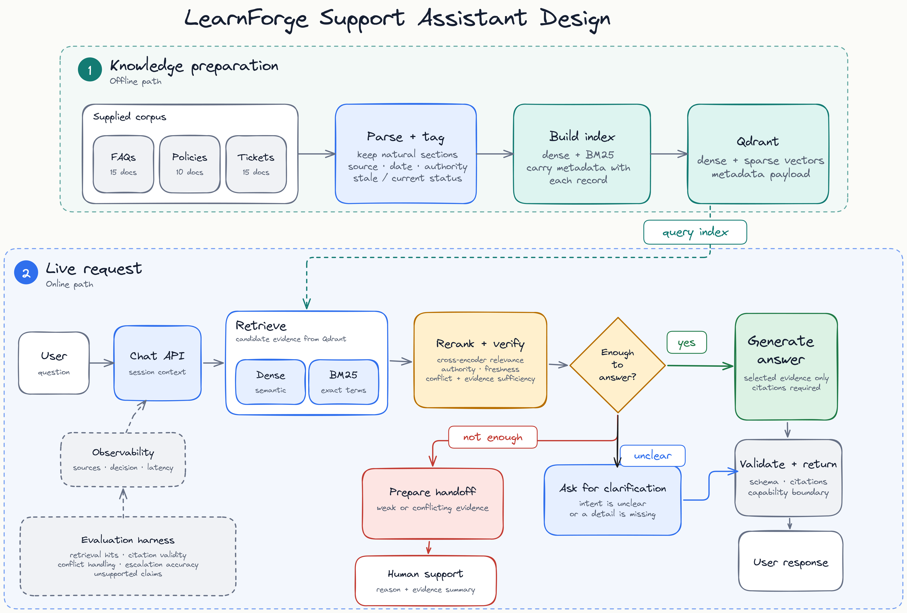
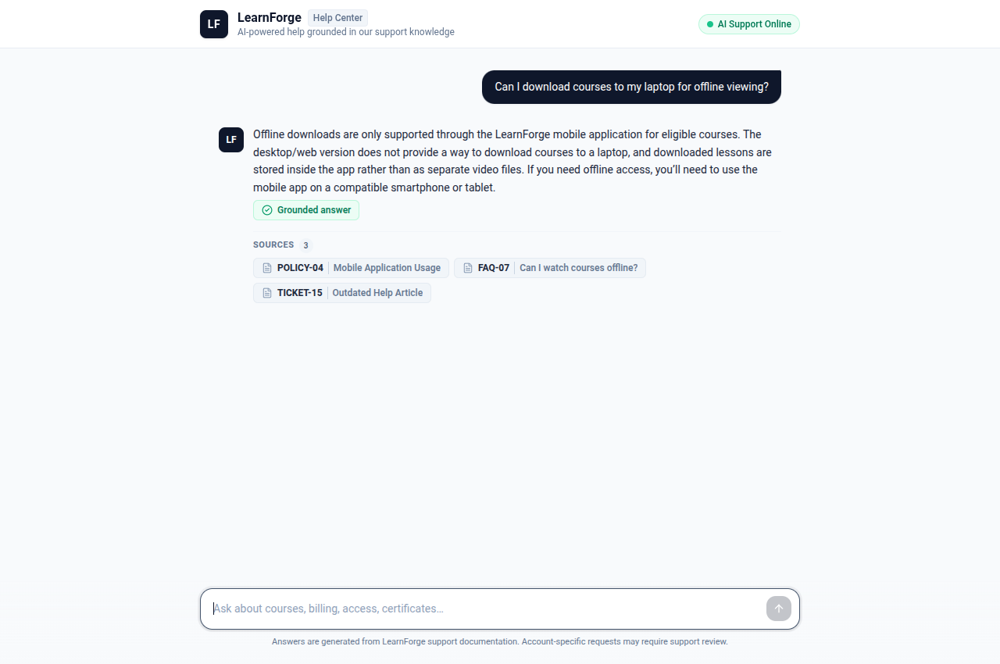

# LearnForge Support Assistant

A reliability-focused support assistant for an ed-tech platform. It retrieves from a small internal knowledge base, distinguishes current policy from historical support examples, and returns one of three bounded outcomes: `ANSWER`, `CLARIFY`, or `ESCALATE`.

[Architecture](#architecture) · [Evaluation](#evaluation) · [Data schema](DATA_SCHEMA.md)

## What it does

- Answers grounded support questions with verified record citations.
- Uses bounded conversation history for follow-up questions.
- Treats current policy as stronger evidence than FAQs and historical tickets.
- Clarifies ambiguous intent and escalates account-specific, unsupported, or exception requests.
- Provides optional, fail-open Langfuse traces for requests and live evaluation runs.

## Architecture



The indexer turns each natural FAQ, policy section, and support ticket into one Qdrant record with source and freshness metadata. At request time, dense and BM25 retrieval are fused with RRF, then a cross-encoder selects the evidence passed to the LLM. The reliability layer orders evidence by authority; structured output and citation validation determine the final response.

## Reliability approach

| Problem | Approach |
| --- | --- |
| Unsupported or invented guidance | Evidence-only generation and a citation whitelist |
| Stale guidance | Temporal metadata and source precedence |
| Policy/ticket conflict | Current policy wins; unresolved cases escalate |
| Ambiguous intent | `CLARIFY` with a focused follow-up |
| Account actions or exceptions | `ESCALATE`; the assistant never performs changes |

## Retrieval

Dense search (`BAAI/bge-small-en-v1.5`) handles paraphrase and conversational wording; BM25 (`Qdrant/bm25`) preserves exact terms such as policy IDs, durations, and billing phrases. Reciprocal Rank Fusion merges their rankings without mixing incomparable scores. The top ten candidates are reranked locally with `Xenova/ms-marco-MiniLM-L-6-v2`; the top five become the evidence set.

## Evaluation

The [golden set](eval/golden.jsonl) was used during development. The separate [holdout set](eval/holdout.jsonl) checks generalization and is not a tuning target. The latest recorded live run used `qwen/qwen3.8-27b` through Groq.

| Dataset | Hit@5 | Decision accuracy | Unsupported claim rate | recall |
| --- | ---: | ---: | ---: | ---: |
| Golden (25 cases) | 100% | 96% | 0% | 100% |
| Holdout (10 cases) | 100% | 90% | 0% | 100% |

The holdout’s lower precision reflects one conservative escalation for an institution-managed account. That trade-off is deliberate: uncertain account context should be reviewed rather than guessed.

Run both suites independently:

```bash
python -m scripts.run_eval --offline
python -m scripts.run_eval --live
```

Generated reports are written to `eval/results/` and ignored by Git.

## Observability

Langfuse is optional and does not participate in answer generation. When enabled, a `support-request` trace contains `hybrid-retrieval`, `cross-encoder-reranking`, `reliability-check`, Groq generation, and `response-validation` stages. It records the query, selected record IDs, evidence freshness/authority, model, final decision, citations, and latency without emitting embeddings or secrets.

Live evaluation traces add `eval_dataset`, `eval_case_id`, `eval_category`, expected/actual decisions, and applicable scores such as `decision_correct`, `retrieval_hit_at_5`, and `citation_valid`.

## Demo UI

The frontend uses assistant-ui’s `LocalRuntime` and calls the existing FastAPI endpoint directly; it does not require Assistant Cloud.



Start it after the API is running:

```bash
cd frontend
npm install
npm run dev
```

Set `VITE_API_BASE_URL` in `frontend/.env` only when the API is not running at `http://localhost:8000`.

## Quick start

Requires Python 3.11+ and Node.js 20+ for the demo UI.

```bash
git clone <repo-url>
cd edversity_assignment

python3 -m venv .venv
source .venv/bin/activate
pip install -e ".[dev]"

cp .env.example .env
# Add GROQ_API_KEY to .env for live generation.
python -m scripts.build_index
uvicorn learnforge_support.api:app --reload --port 8000
```

Tests run with mocked LLM boundaries:

```bash
pytest
ruff check .
```

## Data schema

See [DATA_SCHEMA.md](DATA_SCHEMA.md) for the indexed representation. Source type, authority, temporal status, deprecation markers, and content hashes are stored with every vector so retrieval relevance does not become policy truth.

## Trade-offs

- Local Qdrant keeps the prototype self-contained; a hosted deployment would use a managed cluster.
- Natural logical records preserve policy conditions better than arbitrary token chunks for this 40-record corpus.
- One structured LLM call plus a bounded retry is easier to inspect than multi-agent orchestration.
- Groq calls are paced per process and honor provider retry guidance; a multi-instance deployment would need shared rate limiting.
- In-memory sessions keep the demo simple; production would use a shared, expiring store.
- Escalation favors safety over maximizing answer rate.
- The holdout is intentionally small; a production rollout would expand it from real, privacy-reviewed support traffic.

## Limitations and next steps

This is a take-home prototype, not a deployed support system. A production version would add durable sessions, managed vector storage, access controls, incremental content updates, and a larger evaluation set. A short demo video can be linked next to the Architecture and Evaluation links above when it is available.
